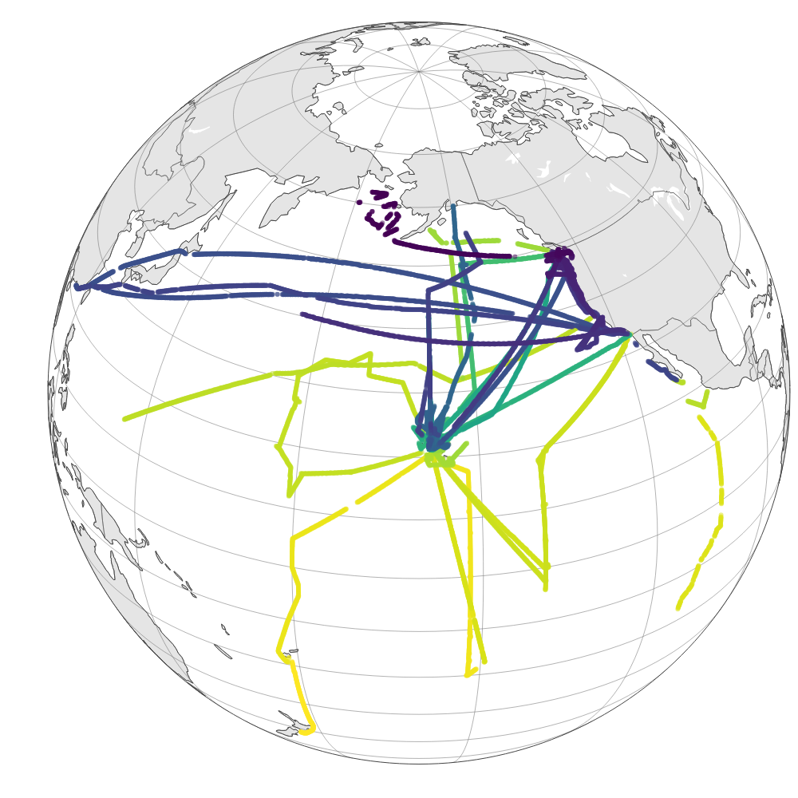

# seaflow-sfl

The ship’s real-time feed of position, time, temperature, salinity is broadcast either over the ship’s network or over a serial data cable. This data stream is read by the SeaFlow computer and recorded as a text file (SFL file). Additional data streams from the SeaFlow instrument, such as sample stream pressure are also recorded. The format of the underway data differs among ships, so we use custom scrips to convert/curate the ship data into a format recognized by our analysis software. Any data not broadcasted during the cruise can be retrieved later from the [Rolling Deck to Repository (R2R)](http://www.rvdata.us).

Each SFL file contains the following information:

- FILE: SeaFlow filename

- DATE: data and time in GMT

- FILE DURATION: acquisition time (sec)

- LAT: latitude (deg N)

- LON: longitude (deg W)

- CONDUCTIVITY: seawater conductivity (s/m)

- SALINITY: seawater salinity (psu)

- OCEAN TEMP: seawater temperature (deg C)

- PAR: Photosynthetic Active Radiations above surface water (µmol/m2/s)

- BULK RED: bulk red fluorescence measured by SeaFlow (unitless)

- STREAM PRESSURE: pressure of the sample line (psi), usually set at 12, which can then be converted to sample flow rate (mL min-1)

- EVENT RATE: number of events (i.e., particles) recorded per second (should be below 18,000 for quality data) by SeaFlow

***François Ribalet, Chris Berthiaume, Annette Hynes, Jordan Winter, Sophie Clayton, Megan Schatz and Jarred Swalwell contributed to this project***
